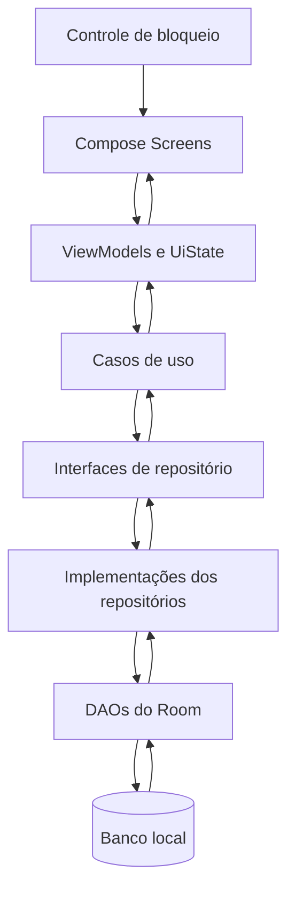
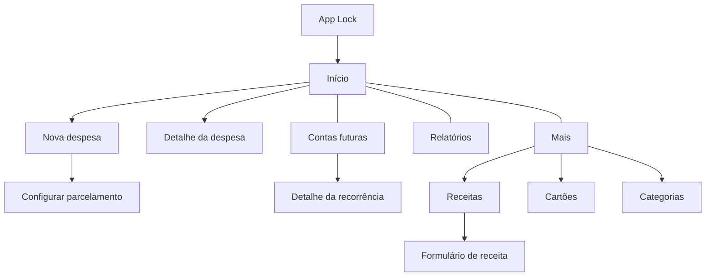
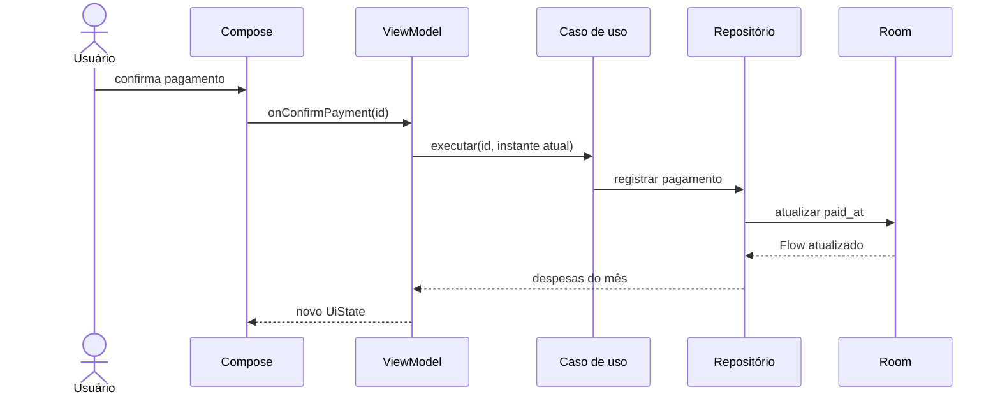

# Minhas Finanças — Arquitetura Técnica da V1

**Status:** proposta para validação.

## 1. Objetivo

Este documento transforma os requisitos, fluxos e modelo conceitual validados em uma proposta técnica para o aplicativo Android. Ele define arquitetura, persistência, casos de uso, navegação, organização do projeto, testes e ordem de implementação, sem criar código-fonte.

## 2. Decisões principais

| Área | Decisão para a V1 |
|---|---|
| Linguagem | Kotlin |
| Pacote | `br.com.arthiviatech` |
| SDK mínimo | Android 6, API 23 |
| SDK alvo | API 36 ou superior, conforme exigência vigente na publicação |
| Interface | Jetpack Compose com Material 3 |
| Estrutura Android | Uma `Activity` e destinos Compose |
| Arquitetura | UI, domínio e dados |
| Fluxo de estado | Fluxo unidirecional de dados (UDF) |
| Estado de tela | `ViewModel` expondo estado imutável |
| Assincronismo | Coroutines e Flow |
| Persistência | Room como fonte única de verdade |
| Injeção de dependências | Koin |
| Navegação | Navigation Compose com rotas tipadas |
| Autenticação local | Biometric Prompt e credencial do dispositivo |
| Módulos Gradle | Um módulo `app` na V1 |
| Organização interna | Pacotes por funcionalidade, apoiados por pacotes centrais |
| Orientação | Retrato e paisagem |
| Tema | Claro e escuro, seguindo o sistema por padrão |

As versões das dependências serão fixadas em um catálogo Gradle no momento da criação do projeto, usando versões estáveis compatíveis entre si.

## 3. Justificativa arquitetural

A documentação oficial recomenda separar UI e dados, usar repositórios, ViewModels, coroutines, Flow e fluxo unidirecional. A camada de domínio é opcional, mas será usada neste projeto porque regras como parcelamento, vencimento de cartão, materialização mensal e recorrências são reutilizadas por diferentes telas e exigem testes isolados.



### 3.1 UI

- Composables renderizam somente o estado recebido e emitem ações do usuário.
- Cada tela principal possui um `ViewModel`.
- O `ViewModel` expõe um `StateFlow<UiState>` imutável.
- Eventos transitórios, como confirmação de salvamento, são representados explicitamente sem serem persistidos como estado permanente da tela.
- A coleta do estado respeita o ciclo de vida da tela.

### 3.2 Domínio

- Casos de uso concentram as regras financeiras e coordenam transações.
- Modelos de domínio não dependem de Room, Compose ou classes de interface do Android.
- Cálculos de datas recebem uma abstração de relógio para permitir testes determinísticos.
- Dinheiro é representado no domínio em centavos, evitando `Float` e `Double`.

### 3.3 Dados

- Room é a única fonte persistente da V1.
- DAOs acessam tabelas e não são chamados diretamente pelos ViewModels.
- Repositórios transformam entidades do banco em modelos de domínio.
- Operações que alteram várias tabelas são atômicas.
- Consultas observáveis retornam `Flow` para atualizar a UI quando o banco mudar.

## 4. Modelo lógico do Room

### 4.1 Convenções físicas

| Conceito | Representação proposta |
|---|---|
| Identificador | `INTEGER`/`Long`, chave primária gerada localmente |
| Dinheiro | `INTEGER`/`Long` em centavos |
| Data civil | `INTEGER`/`Long` como epoch day |
| Data e hora | `INTEGER`/`Long` como epoch milliseconds |
| Mês de referência | `INTEGER`, calculado como `ano × 12 + mês` |
| Booleano | `INTEGER` do SQLite, mapeado para `Boolean` |
| Enum | Código inteiro estável convertido por `TypeConverter` |
| Nome de tabela/coluna | `snake_case` |

O mês de referência é armazenado explicitamente nos lançamentos para simplificar filtros, unicidade e relatórios. Ele deve ser calculado a partir do vencimento da despesa ou da data prevista da receita.

### 4.2 Tabelas

#### `categories`

| Coluna | Nula | Observação |
|---|---:|---|
| `id` | Não | Chave primária |
| `name` | Não | Nome exibido |
| `system_defined` | Não | Impede renomear categorias iniciais |
| `enabled` | Não | `true` por padrão |
| `disabled_at` | Sim | Obrigatória quando desativada |

#### `cards`

| Coluna | Nula | Observação |
|---|---:|---|
| `id` | Não | Chave primária |
| `name` | Não | Nome exibido |
| `due_day` | Não | Entre 1 e 31 |
| `closing_day` | Sim | Entre 1 e 31, quando informado |
| `enabled` | Não | Estado lógico |
| `disabled_at` | Sim | Data e hora da desativação |

#### `installment_plans`

| Coluna | Nula | Observação |
|---|---:|---|
| `id` | Não | Chave primária |
| `description` | Não | Descrição comum inicial |
| `installment_count` | Não | Maior que zero |
| `installment_amount_cents` | Não | Maior que zero |
| `informational_total_cents` | Não | Valor calculado |
| `first_due_date` | Não | Primeira data de vencimento |
| `category_id` | Não | Categoria usada na criação |
| `payment_method` | Não | Código estável |
| `card_id` | Sim | Obrigatório para cartão |
| `enabled` | Não | Estado lógico do agrupador |
| `disabled_at` | Sim | Data e hora da desativação |

#### `recurring_expenses`

| Coluna | Nula | Observação |
|---|---:|---|
| `id` | Não | Chave primária |
| `description` | Não | Nome da conta futura |
| `category_id` | Não | Categoria sugerida |
| `due_day` | Não | Entre 1 e 31 |
| `payment_method` | Não | Forma sugerida |
| `card_id` | Sim | Cartão sugerido |
| `start_month` | Não | Primeiro mês aplicável |
| `enabled` | Não | `false` significa encerrada |
| `disabled_at` | Sim | Data e hora do encerramento |

#### `recurrence_pauses`

| Coluna | Nula | Observação |
|---|---:|---|
| `id` | Não | Chave primária |
| `recurring_expense_id` | Não | Recorrência relacionada |
| `paused_at` | Não | Início do período |
| `resumed_at` | Sim | Fim do período |
| `resumes_from_month` | Sim | Mês da retomada |
| `enabled` | Não | Estado lógico do período |
| `disabled_at` | Sim | Data e hora da desativação lógica |

#### `expense_entries`

| Coluna | Nula | Observação |
|---|---:|---|
| `id` | Não | Chave primária |
| `description` | Não | Descrição do lançamento |
| `amount_cents` | Não | Maior que zero |
| `purchase_date` | Não | Data da compra ou contratação |
| `due_date` | Não | Data de vencimento |
| `reference_month` | Não | Derivado do vencimento |
| `category_id` | Não | Categoria relacionada |
| `payment_method` | Não | Forma de pagamento |
| `card_id` | Sim | Obrigatório para cartão |
| `paid_at` | Sim | Preenchido após confirmação |
| `origin` | Não | Eventual, parcelada ou recorrente |
| `installment_plan_id` | Sim | Origem parcelada |
| `installment_number` | Sim | Posição na série |
| `installment_count` | Sim | Total da série |
| `recurring_expense_id` | Sim | Origem recorrente |
| `enabled` | Não | Estado lógico |
| `disabled_at` | Sim | Data e hora da desativação |

O estado pendente, pago ou atrasado não será armazenado. Ele será calculado a partir de `paid_at`, `due_date` e da data atual.

#### `fixed_revenues`

| Coluna | Nula | Observação |
|---|---:|---|
| `id` | Não | Chave primária |
| `description` | Não | Nome da receita |
| `start_month` | Não | Primeiro mês aplicável |
| `category_id` | Sim | Categoria opcional |
| `enabled` | Não | Permite materialização futura |
| `disabled_at` | Sim | Data e hora da desativação |

#### `fixed_revenue_versions`

| Coluna | Nula | Observação |
|---|---:|---|
| `id` | Não | Chave primária |
| `fixed_revenue_id` | Não | Receita fixa relacionada |
| `default_amount_cents` | Não | Maior que zero |
| `expected_day` | Não | Entre 1 e 31 |
| `effective_from_month` | Não | Início da vigência |
| `enabled` | Não | Estado lógico da versão |
| `disabled_at` | Sim | Data e hora da desativação lógica |

#### `revenue_entries`

| Coluna | Nula | Observação |
|---|---:|---|
| `id` | Não | Chave primária |
| `description` | Não | Descrição do lançamento |
| `amount_cents` | Não | Maior que zero |
| `expected_date` | Não | Data prevista |
| `reference_month` | Não | Derivado da data prevista |
| `origin` | Não | Fixa ou eventual |
| `fixed_revenue_id` | Sim | Origem fixa |
| `category_id` | Sim | Categoria opcional |
| `enabled` | Não | Estado lógico |
| `disabled_at` | Sim | Data e hora da desativação |

### 4.3 Chaves estrangeiras

- Exclusões físicas não serão propagadas.
- Relações usarão comportamento restritivo ou sem ação, pois os registros são desativados logicamente.
- Uma referência pode apontar para categoria, cartão ou modelo desativado para preservar o histórico.
- DAOs deverão carregar relações usando projeções próprias, pois entidades Room não devem conter referências diretas a outras entidades.

### 4.4 Índices e unicidade

Índices previstos:

- `expense_entries(reference_month, enabled)`;
- `expense_entries(due_date, paid_at, enabled)`;
- `expense_entries(category_id, reference_month)`;
- `expense_entries(card_id, reference_month)`;
- `revenue_entries(reference_month, enabled)`;
- `recurrence_pauses(recurring_expense_id)`;
- `fixed_revenue_versions(fixed_revenue_id, effective_from_month)`.

Restrições únicas:

- `expense_entries(installment_plan_id, installment_number)` quando houver parcelamento;
- `expense_entries(recurring_expense_id, reference_month)` quando houver recorrência;
- `revenue_entries(fixed_revenue_id, reference_month)` quando houver receita fixa;
- `fixed_revenue_versions(fixed_revenue_id, effective_from_month)`.

Quando uma restrição condicional não puder ser expressa diretamente pelas anotações usadas, ela deverá ser garantida por transação e consulta prévia, com teste de concorrência.

## 5. DAOs e transações

### DAOs

- `CategoryDao`
- `CardDao`
- `ExpenseDao`
- `InstallmentPlanDao`
- `RecurringExpenseDao`
- `RecurrencePauseDao`
- `RevenueDao`
- `FixedRevenueDao`
- `ReportDao`

### Operações transacionais obrigatórias

- criar um parcelamento e todas as suas parcelas;
- desativar uma parcela e todas as parcelas futuras selecionadas;
- confirmar uma recorrência e criar uma única despesa para o mês;
- materializar receitas fixas ausentes de um mês;
- alterar o padrão futuro de uma receita criando uma nova versão;
- pausar ou reativar uma recorrência e registrar o período;
- encerrar um modelo sem modificar seus lançamentos históricos.

## 6. Repositórios

| Repositório | Responsabilidade |
|---|---|
| `CategoryRepository` | Categorias iniciais, personalizadas e desativação |
| `CardRepository` | Cadastro, edição, consulta e desativação de cartões |
| `ExpenseRepository` | Lançamentos, pagamentos, filtros e soft delete |
| `InstallmentRepository` | Parcelamentos e operações sobre séries |
| `RecurringExpenseRepository` | Contas futuras, confirmação, pausa e encerramento |
| `RevenueRepository` | Receitas fixas, versões, ocorrências e eventuais |
| `ReportRepository` | Resumos e agrupamentos mensais |

As interfaces pertencem ao limite usado pelo domínio. As implementações Room pertencem à camada de dados.

## 7. Casos de uso

### Calendário e valores

- `ResolveDateForMonthUseCase`
- `CalculateCardDueDateUseCase`
- `CalculateInstallmentDatesUseCase`
- `CalculateMonthlyBalanceUseCase`

### Despesas

- `CreateExpenseUseCase`
- `CreateInstallmentPlanUseCase`
- `UpdateExpenseUseCase`
- `ConfirmExpensePaymentUseCase`
- `DisableExpenseUseCase`
- `DisableInstallmentsFromUseCase`
- `ObserveMonthlyExpensesUseCase`

### Recorrências

- `ObserveFutureAccountsUseCase`
- `ConfirmRecurringExpenseForMonthUseCase`
- `PauseRecurringExpenseUseCase`
- `ResumeRecurringExpenseUseCase`
- `DisableRecurringExpenseUseCase`

### Receitas

- `CreateFixedRevenueUseCase`
- `CreateEventualRevenueUseCase`
- `MaterializeFixedRevenuesForMonthUseCase`
- `UpdateRevenueForMonthUseCase`
- `UpdateFutureFixedRevenueUseCase`
- `ObserveMonthlyRevenuesUseCase`

### Cadastros e relatórios

- operações de criar, editar, consultar e desativar categorias e cartões;
- `ObserveMonthlySummaryUseCase`;
- `ObserveExpensesByCategoryUseCase`;
- `ObserveExpensesByCardUseCase`.

Casos de uso triviais poderão ser omitidos se apenas repassarem uma chamada do ViewModel ao repositório. Os casos listados que contêm regra financeira devem permanecer explícitos.

## 8. Navegação



Destinos principais da barra inferior:

- Início;
- Contas futuras;
- Relatórios;
- Mais.

Regras:

- rotas recebem somente identificadores e valores simples;
- cada tela carrega seus dados pelo ViewModel;
- objetos completos não são transportados entre destinos;
- Início, Contas futuras e Relatórios compartilham o conceito de mês selecionado, preservado em um estado de navegação adequado;
- formulários com alteração não salva interceptam a saída e pedem confirmação;
- o botão Voltar segue a pilha de navegação do Android.

## 9. Estado das telas

Cada tela terá:

- `UiState`: dados imutáveis necessários para renderização;
- ações públicas no ViewModel: intenções do usuário;
- estados de carregamento, conteúdo, vazio e erro recuperável;
- validação de formulário com mensagens por campo;
- estado salvo para entradas ainda não persistidas quando adequado.

Exemplo conceitual do fluxo:



## 10. Organização do projeto

```text
app/
└── src/main/java/<pacote>/
    ├── app/
    │   ├── MyFinancesApplication
    │   └── MainActivity
    ├── core/
    │   ├── database/
    │   │   ├── dao/
    │   │   ├── entity/
    │   │   ├── relation/
    │   │   ├── converter/
    │   │   └── migration/
    │   ├── model/
    │   ├── designsystem/
    │   ├── navigation/
    │   ├── security/
    │   └── time/
    ├── data/
    │   ├── mapper/
    │   └── repository/
    ├── domain/
    │   ├── repository/
    │   └── usecase/
    └── feature/
        ├── home/
        ├── expenses/
        ├── futureaccounts/
        ├── reports/
        ├── more/
        ├── revenues/
        ├── cards/
        └── categories/
```

Cada pasta de funcionalidade poderá conter `Screen`, `ViewModel`, `UiState`, componentes específicos e rotas. Componentes reutilizados por várias funcionalidades ficam em `core`.

O projeto começará com um único módulo Gradle. A separação em módulos só será considerada se tempos de compilação, trabalho em equipe ou reutilização criarem uma necessidade concreta.

## 11. Autenticação e privacidade local

- A Activity verificará a disponibilidade de credencial segura no dispositivo.
- Quando disponível, o app aceitará biometria forte ou credencial de tela do aparelho pelo diálogo do sistema.
- Se não houver bloqueio configurado, a tela principal será aberta diretamente, conforme requisito.
- O instante em que o app entra em segundo plano será mantido em memória usando relógio monotônico.
- Após cinco minutos, a UI financeira será coberta e uma nova autenticação será exigida.
- Se o processo for encerrado, uma nova abertura começa bloqueada quando houver credencial disponível.
- Cancelar ou falhar a autenticação mantém os dados financeiros ocultos.

O bloqueio controla o acesso pela interface. A V1 não definiu criptografia adicional do arquivo Room, backup ou sincronização.

## 12. Estratégia de testes

### Testes unitários obrigatórios

- ajuste dos dias 29, 30 e 31, incluindo ano bissexto;
- vencimento de cartão antes, no dia e depois do fechamento;
- datas das parcelas e total informativo;
- cálculo dos estados pendente, atrasado e pago;
- cálculo do saldo mensal;
- seleção da versão correta de uma receita fixa;
- ausência de materialização duplicada;
- pausa, reativação e ausência de lançamentos retroativos;
- alcance da desativação de parcelas futuras;
- invariantes de `enabled` e `disabledAt`.

### Testes de banco

- chaves estrangeiras e índices;
- consultas mensais e agrupamentos;
- transações de parcelamento, recorrência e receita fixa;
- preservação das relações após soft delete;
- migrações do banco a partir da primeira versão publicada.

### Testes de UI essenciais

- criar despesa eventual e parcelada;
- confirmar conta futura;
- registrar pagamento com confirmação;
- alterar receita somente no mês;
- navegar entre os quatro destinos principais;
- bloquear o conteúdo após o período definido.

## 13. Plano incremental de implementação

### Entrega 1 — Fundação

- projeto Android, tema e navegação básica;
- Koin, Room e infraestrutura de tempo;
- esquema inicial e categorias predefinidas;
- pipeline de testes.

### Entrega 2 — Cadastros auxiliares

- categorias;
- cartões;
- soft delete e integridade histórica.

### Entrega 3 — Despesas

- despesa eventual;
- listagem mensal, filtros e estados derivados;
- confirmação de pagamento.

### Entrega 4 — Parcelamentos

- cálculo do primeiro vencimento;
- criação transacional das parcelas;
- edição individual e desativação futura.

### Entrega 5 — Receitas

- receitas eventuais;
- receitas fixas e versões;
- materialização mensal e alteração isolada.

### Entrega 6 — Contas futuras

- recorrências variáveis;
- confirmação mensal;
- pausa, retomada e encerramento.

### Entrega 7 — Resumo e relatórios

- saldo previsto;
- indicadores da tela Início;
- agrupamentos por categoria e cartão.

### Entrega 8 — Segurança e acabamento

- autenticação pelo dispositivo;
- bloqueio após cinco minutos;
- estados vazios, erros e acessibilidade;
- revisão integral dos critérios de aceite.

Cada entrega deve terminar em uma parte utilizável e verificável do aplicativo.

## 14. Configuração do projeto

- Pacote: `br.com.arthiviatech`.
- SDK mínimo: API 23, com ampla cobertura de dispositivos e compatibilidade com o padrão atual do AndroidX.
- SDK alvo para a configuração inicial: API 36 ou superior, respeitando a exigência vigente da Google Play no momento da publicação.
- Orientações: retrato e paisagem.
- Temas: claro e escuro, seguindo o tema do dispositivo por padrão.
- Cores de marca: azul como cor primária e laranja como cor secundária.
- Nome exibido: **Minhas Finanças**.
- Logo de referência: `logo_app.png`, com derivados adaptativos, monocromáticos e de loja a serem preparados antes da implementação visual.

## 15. Referências oficiais consultadas

- [Guia de arquitetura de aplicativos Android](https://developer.android.com/topic/architecture)
- [Recomendações de arquitetura Android](https://developer.android.com/topic/architecture/recommendations)
- [Camada de UI e fluxo unidirecional](https://developer.android.com/topic/architecture/ui-layer)
- [Camada de domínio](https://developer.android.com/topic/architecture/domain-layer)
- [Camada de dados](https://developer.android.com/topic/architecture/data-layer)
- [Persistência local com Room](https://developer.android.com/training/data-storage/room)
- [Relacionamentos no Room](https://developer.android.com/training/data-storage/room/relationships)
- [Navegação no Android](https://developer.android.com/guide/navigation)
- [Autenticação biométrica e credencial do dispositivo](https://developer.android.com/identity/sign-in/biometric-auth)
- [Configuração Gradle do Koin](https://insert-koin.io/docs/setup/gradle/)
- [Koin para Jetpack Compose](https://insert-koin.io/docs/reference/koin-compose/compose/)
- [Boas práticas de coroutines](https://developer.android.com/kotlin/coroutines/coroutines-best-practices)
- [Versões AndroidX e SDK mínimo padrão](https://developer.android.com/jetpack/androidx/versions)
- [Requisitos de API alvo da Google Play](https://support.google.com/googleplay/android-developer/answer/11926878)
