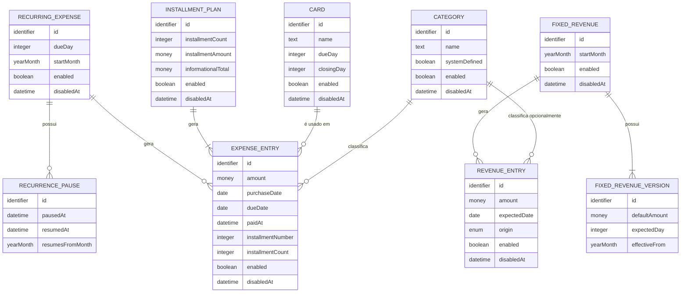
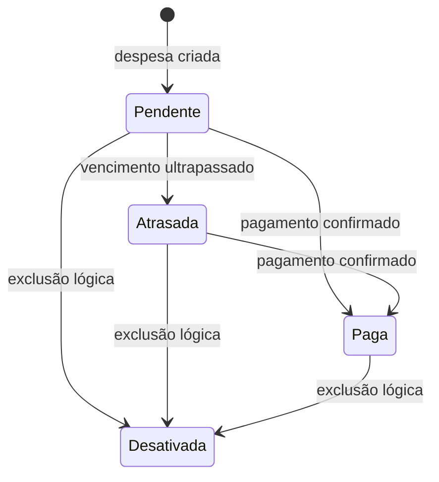
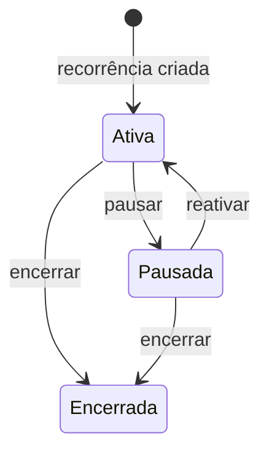

# Minhas Finanças — Modelo Conceitual de Dados e Domínio da V1

**Status:** validado para a V1 em 13/09/2026.

## 1. Objetivo

Este documento define os conceitos, relacionamentos e regras de integridade da V1. O modelo é independente de Room, Kotlin ou qualquer arquitetura de implementação.

## 2. Princípios do modelo

- Um lançamento representa um valor financeiro atribuído a um mês.
- Modelos recorrentes descrevem regras; lançamentos mensais preservam o que ocorreu em cada mês.
- Parcelamentos finitos são separados das despesas geradas por eles.
- O estado atrasado é derivado da data de vencimento e do pagamento.
- A desativação é lógica e preserva os relacionamentos históricos.
- Alterações futuras não modificam lançamentos históricos.
- Valores monetários devem preservar centavos sem perda de precisão.

## 3. Visão geral dos relacionamentos



## 4. Entidades

### 4.1 Categoria (`Category`)

Classifica receitas ou despesas por finalidade.

| Atributo | Obrigatório | Descrição |
|---|---:|---|
| Identificador | Sim | Identidade estável da categoria |
| Nome | Sim | Nome exibido ao usuário |
| Definida pelo sistema | Sim | Distingue categorias iniciais das personalizadas |
| Ativa | Sim | Indica disponibilidade nas operações comuns |
| Desativada em | Não | Data e hora da desativação |

Regras:

- categorias iniciais: Assinaturas e Serviços, Alimentação, Moradia, Diversos, Compras e Pet;
- categorias iniciais podem ser desativadas, mas não renomeadas;
- categorias personalizadas podem ser criadas, renomeadas e desativadas;
- o nome utilizado por um lançamento histórico deve continuar disponível após a desativação.

### 4.2 Cartão (`Card`)

Representa uma forma de pagamento usada para agrupar despesas em relatórios.

| Atributo | Obrigatório | Descrição |
|---|---:|---|
| Identificador | Sim | Identidade estável do cartão |
| Nome | Sim | Nome exibido ao usuário |
| Dia de vencimento | Sim | Dia-base do vencimento |
| Dia de fechamento | Não | Dia usado para calcular o primeiro vencimento |
| Ativo | Sim | Indica disponibilidade para novos lançamentos |
| Desativado em | Não | Data e hora da desativação |

O cartão não possui limite e não gera uma entidade de fatura. As despesas são controladas individualmente e apenas agrupadas por cartão nos relatórios.

### 4.3 Lançamento de despesa (`ExpenseEntry`)

Representa uma despesa efetivamente incluída em determinado mês.

| Atributo | Obrigatório | Descrição |
|---|---:|---|
| Identificador | Sim | Identidade estável do lançamento |
| Descrição | Sim | Identificação da despesa |
| Valor | Sim | Valor positivo da despesa |
| Categoria | Sim | Categoria associada |
| Data da compra/contratação | Sim | Data de origem da despesa |
| Data de vencimento | Sim | Determina o mês financeiro e eventual atraso |
| Forma de pagamento | Sim | Meio usado no pagamento |
| Cartão | Condicional | Obrigatório quando a forma for cartão |
| Pago em | Não | Data e hora em que o usuário confirmou o pagamento |
| Origem | Sim | Eventual, parcelamento ou recorrência variável |
| Parcelamento | Condicional | Presente quando gerado por um parcelamento |
| Número da parcela | Condicional | Posição da parcela na série |
| Total de parcelas | Condicional | Quantidade total da série |
| Recorrência | Condicional | Presente quando gerado por uma recorrência variável |
| Ativo | Sim | Controla a desativação lógica |
| Desativado em | Não | Data e hora da desativação |

O estado exibido é derivado:

```text
se paidAt estiver preenchido                     → Paga
senão, se a data atual for posterior ao vencimento → Atrasada
senão                                             → Pendente
```

### 4.4 Parcelamento (`InstallmentPlan`)

Agrupa uma série finita de despesas parceladas.

| Atributo | Obrigatório | Descrição |
|---|---:|---|
| Identificador | Sim | Identidade do parcelamento |
| Descrição | Sim | Descrição comum das parcelas |
| Quantidade de parcelas | Sim | Quantidade finita, maior que zero |
| Valor da parcela | Sim | Valor positivo de cada parcela |
| Total informativo | Sim | Quantidade multiplicada pelo valor da parcela |
| Primeiro vencimento | Sim | Data-base da primeira parcela |
| Categoria | Sim | Categoria aplicada inicialmente às parcelas |
| Forma de pagamento | Sim | Forma aplicada inicialmente às parcelas |
| Cartão | Condicional | Cartão associado, quando aplicável |
| Ativo | Sim | Estado lógico do agrupador |
| Desativado em | Não | Data e hora da desativação |

Todas as parcelas são materializadas no cadastro. Depois disso, cada lançamento pode ser editado ou desativado individualmente sem modificar os demais.

### 4.5 Recorrência de despesa (`RecurringExpense`)

É o modelo de uma despesa variável que pode ocorrer todos os meses.

| Atributo | Obrigatório | Descrição |
|---|---:|---|
| Identificador | Sim | Identidade da recorrência |
| Descrição | Sim | Nome apresentado em Contas futuras |
| Categoria | Sim | Categoria sugerida para o lançamento |
| Dia de vencimento | Sim | Dia-base do vencimento mensal |
| Forma de pagamento | Sim | Forma sugerida |
| Cartão | Condicional | Cartão sugerido, quando aplicável |
| Mês inicial | Sim | Primeiro mês em que poderá ser apresentada |
| Ativa | Sim | `false` significa recorrência encerrada |
| Desativada em | Não | Data e hora do encerramento |

A recorrência não cria uma despesa até que o usuário confirme o valor do mês. A combinação entre recorrência e mês deve ser única para impedir lançamentos duplicados.

Cada pausa será preservada como um período associado à recorrência. Ao reativá-la, o período recebe a data e a hora de reativação e o mês a partir do qual a recorrência volta a valer. Nenhum mês transcorrido durante a pausa é criado retroativamente.

### 4.6 Período de pausa (`RecurrencePause`)

Preserva os intervalos nos quais uma recorrência esteve pausada.

| Atributo | Obrigatório | Descrição |
|---|---:|---|
| Identificador | Sim | Identidade do período de pausa |
| Recorrência | Sim | Recorrência à qual pertence |
| Pausada em | Sim | Data e hora em que a pausa começou |
| Reativada em | Não | Data e hora da reativação; vazia durante uma pausa ativa |
| Retoma no mês | Não | Mês corrente definido no momento da reativação |

Uma recorrência pode possuir vários períodos históricos, mas no máximo um período de pausa aberto.

### 4.7 Lançamento de receita (`RevenueEntry`)

Representa uma receita atribuída a um mês.

| Atributo | Obrigatório | Descrição |
|---|---:|---|
| Identificador | Sim | Identidade estável do lançamento |
| Descrição | Sim | Identificação da receita |
| Valor | Sim | Valor positivo da receita |
| Data prevista | Sim | Data de referência no mês |
| Origem | Sim | Fixa ou eventual |
| Receita fixa | Condicional | Modelo de origem, quando for fixa |
| Categoria | Não | Classificação opcional |
| Ativa | Sim | Controla a desativação lógica |
| Desativada em | Não | Data e hora da desativação |

Receitas não possuem estado de recebimento. Todo lançamento ativo participa do saldo previsto.

### 4.8 Receita fixa (`FixedRevenue`)

Representa a identidade e o ciclo de vida de uma receita que se repete mensalmente.

| Atributo | Obrigatório | Descrição |
|---|---:|---|
| Identificador | Sim | Identidade do modelo |
| Descrição | Sim | Nome da receita |
| Mês inicial | Sim | Primeiro mês aplicável |
| Categoria | Não | Classificação opcional sugerida |
| Ativa | Sim | Indica se pode gerar novas ocorrências |
| Desativada em | Não | Data e hora da desativação |

Um lançamento mensal é materializado quando o usuário acessa aquele mês pela primeira vez. A combinação entre receita fixa e mês deve ser única.

### 4.9 Versão da receita fixa (`FixedRevenueVersion`)

Preserva mudanças no valor padrão ou no dia previsto sem alterar meses anteriores.

| Atributo | Obrigatório | Descrição |
|---|---:|---|
| Identificador | Sim | Identidade da versão |
| Receita fixa | Sim | Modelo ao qual pertence |
| Valor padrão | Sim | Valor válido durante a versão |
| Dia previsto | Sim | Dia-base válido durante a versão |
| Vigente desde | Sim | Primeiro mês ao qual a versão se aplica |

Ao acessar um mês ainda não materializado, o aplicativo usa a versão vigente naquele mês. Alterar somente uma ocorrência mensal modifica o lançamento, sem criar uma versão. Alterar o padrão futuro cria uma nova versão com o mês inicial escolhido.

## 5. Ausência de uma entidade Pagamento

A V1 não aceita pagamentos parciais, múltiplos pagamentos, juros ou multas. Por isso, o pagamento é representado pelo campo `paidAt` da despesa. Uma entidade separada adicionaria complexidade sem representar um comportamento exigido nesta versão.

Se pagamentos parciais forem incluídos futuramente, uma entidade Pagamento poderá ser introduzida sem mudar o significado dos lançamentos existentes.

## 6. Regras transversais

### 6.1 Desativação lógica

As entidades de negócio desativáveis possuem `enabled` e `disabledAt`.

- `enabled = true` exige `disabledAt` vazio;
- `enabled = false` exige `disabledAt` preenchido;
- consultas operacionais ignoram registros desativados;
- consultas históricas podem acessar registros desativados;
- cartões e categorias desativados não podem ser usados em novos lançamentos;
- relações históricas não são removidas quando um registro é desativado.

### 6.2 Datas inexistentes

Quando o dia-base não existe em um mês, utiliza-se o último dia daquele mês. O dia-base original é mantido para os meses posteriores.

### 6.3 Mês financeiro

O mês de uma despesa é determinado por sua data de vencimento. O mês de uma receita é determinado por sua data prevista. O período sempre corresponde ao mês civil.

### 6.4 Saldo previsto

```text
saldo previsto = soma das receitas ativas do mês
               − soma das despesas ativas do mês
```

Despesas pagas, pendentes e atrasadas participam do cálculo. Recorrências ainda não confirmadas não são lançamentos e, portanto, não participam.

### 6.5 Cálculo do vencimento no cartão

- Com fechamento configurado, a data da compra e o dia de fechamento determinam se a despesa entra no próximo vencimento ou no subsequente.
- Sem fechamento configurado, o usuário escolhe o mês do primeiro vencimento.
- O dia de vencimento vem do cartão e usa a regra do último dia disponível quando necessário.
- As parcelas seguintes avançam um mês por vez a partir do primeiro vencimento.

### 6.6 Unicidade mensal

Devem ser impedidas duplicações nas seguintes combinações:

- receita fixa + mês de referência;
- recorrência variável + mês de referência;
- parcelamento + número da parcela.

## 7. Ciclos de vida resumidos





## 8. Invariantes do domínio

1. Valores de receitas, despesas e parcelas são sempre maiores que zero.
2. Uma despesa de cartão sempre referencia um cartão ativo no momento do cadastro.
3. Uma categoria deve estar ativa no momento de um novo lançamento.
4. O número de uma parcela fica entre 1 e o total de parcelas.
5. O total informativo do parcelamento é igual à quantidade multiplicada pelo valor da parcela.
6. Uma despesa paga possui `paidAt`; uma pendente ou atrasada não possui.
7. Uma recorrência variável gera no máximo uma despesa por mês.
8. Uma receita fixa gera no máximo uma ocorrência por mês.
9. Desativar uma origem não desativa automaticamente seus lançamentos históricos.
10. Um registro desativado possui `disabledAt` e não é usado em novas operações.
11. Uma recorrência possui no máximo um período de pausa sem data de reativação.

## 9. Decisões preservadas para a implementação futura

- Os nomes das entidades e atributos apresentados são conceituais e podem ser adaptados ao padrão do projeto.
- A forma física de representar dinheiro, datas e enums será definida na modelagem do Room.
- Índices, chaves estrangeiras e estratégias de migração serão definidos no modelo lógico.
- A rotina exata para calcular o vencimento do cartão deverá receber testes específicos na implementação.
