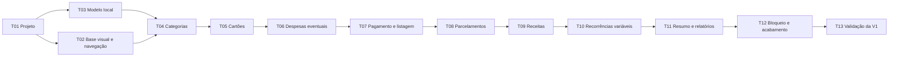

# Minhas Finanças — Plano de tarefas para desenvolvimento da V1

**Status:** execução em andamento; implementação principal da V1 concluída e validação final pendente de dispositivo/emulador.

## Como trabalhar com este plano

As tarefas estão em ordem de dependência. Cada uma deve produzir uma parte verificável que será usada pela próxima. Ao começarmos uma tarefa, marcaremos seu estado, implementaremos apenas o escopo descrito, executaremos as verificações pertinentes e registraremos o resultado neste arquivo. Se uma descoberta alterar uma regra de produto, atualizaremos primeiro o documento de requisitos correspondente.

Estados possíveis: `Pendente`, `Em andamento`, `Concluída` e `Bloqueada`. Uma tarefa só pode ser marcada como concluída quando seus critérios de aceite e verificações tiverem sido satisfeitos. Não anteciparemos tarefas posteriores apenas para preencher telas com funcionalidades incompletas.

**Referências aprovadas:** [requisitos](REQUISITOS_V1.md), [fluxos](FLUXOS_USUARIO_V1.md), [wireframes](WIREFRAMES_V1.md), [modelo conceitual](MODELO_CONCEITUAL_V1.md), [arquitetura técnica](ARQUITETURA_TECNICA_V1.md), [design system](DESIGN_SYSTEM_V1.md) e [ativos da logo](design/logo/README.md).

**Configuração definida:** nome **Minhas Finanças**; pacote de base `br.com.arthiviatech`; `minSdk 23` na proposta original; alvo inicial API 36 ou superior conforme exigência vigente na publicação; Kotlin, Compose, Material 3, Room, Koin, Coroutines e Flow; retrato e paisagem; tema claro e escuro. O projeto criado pelo usuário usa `br.com.arthiviatech.myfinances` e `minSdk 24`; validar essa diferença antes de fechar T01.

## Visão das dependências

## Entrega 1 — Fundação

### T01 — Criar o projeto Android e a rotina de verificação

**Estado:** Concluída  
**Depende de:** nenhum.

**Trabalho:** conferir o projeto Android criado pelo usuário em `MyFinances/`, configurar pacote, SDKs e catálogo de versões; integrar Compose, Material 3, Koin e Room; configurar testes locais e instrumentados. Inicializar Git caso ainda não exista repositório e criar um `.gitignore` apropriado antes de versionar arquivos gerados. Usar versões estáveis e compatíveis das dependências no momento da execução.

**Aceite:** o projeto abre e compila; o aplicativo inicia em emulador ou dispositivo; um teste local e um teste instrumentado mínimo executam; arquivos de build e dados locais não entram no versionamento.

### T02 — Aplicar identidade visual, ícones e navegação vazia

**Estado:** Concluída  
**Depende de:** T01.

**Trabalho:** converter a paleta aprovada em temas claro e escuro; integrar ícone adaptativo, monocromático e legado; montar uma `Activity` e as quatro rotas principais: Início, Contas futuras, Relatórios e Mais. Criar estados vazios úteis, com a ação **Nova despesa** na tela Início e acesso a Receitas, Cartões e Categorias em Mais. Adaptar a estrutura para retrato e paisagem.

**Aceite:** as quatro áreas navegam sem perda indevida da pilha; o tema acompanha o dispositivo; ícones aparecem corretamente; a interface não corta conteúdo em retrato ou paisagem; ações ainda indisponíveis têm destino ou estado vazio claro.

### T03 — Implementar a base do domínio e do Room

**Estado:** Concluída  
**Depende de:** T01.

**Trabalho:** definir tipos de dinheiro em centavos, datas civis, mês de referência e relógio injetável; criar entidades, DAOs, conversores, chaves estrangeiras, índices e a primeira versão do banco conforme o modelo lógico. Implementar convenções de `enabled`/`disabledAt` e consultas que preservem relações históricas. Preparar repositórios e transações sem criar telas funcionais nesta tarefa.

**Aceite:** esquema do Room compila; testes de banco confirmam relações, unicidade mensal, centavos exatos e soft delete; consultas operacionais não mostram registros desativados; consultas históricas ainda recuperam seus nomes e vínculos.

## Entrega 2 — Cadastros auxiliares

### T04 — Implementar categorias

**Estado:** Concluída  
**Depende de:** T02 e T03.

**Trabalho:** cadastrar as seis categorias iniciais uma única vez; criar telas, repositório e operações para listar, criar, editar e desativar categorias. Impedir a renomeação das categorias iniciais. Manter categorias desativadas legíveis em lançamentos antigos.

**Aceite:** Assinaturas e Serviços, Alimentação, Moradia, Diversos, Compras e Pet aparecem no primeiro uso; reabrir o app não as duplica; personalizadas podem ser editadas; iniciais só podem ser desativadas; nenhuma categoria desativada aparece para novos lançamentos.

### T05 — Implementar cartões

**Estado:** Concluída  
**Depende de:** T04.

**Trabalho:** criar cadastro, listagem, edição e desativação de cartões com nome, dia de vencimento e fechamento opcional. Implementar e testar a regra de último dia disponível do mês. Documentar e testar a interpretação exata de fechamento versus próximo vencimento, inclusive quando fechamento e vencimento cruzam o fim do mês, antes de usar o cálculo em despesas.

**Aceite:** dias válidos são aceitos, dados inválidos são rejeitados com mensagem por campo, cartões desativados não podem ser escolhidos em novos lançamentos e o cálculo do próximo vencimento passa em exemplos antes, no dia e depois do fechamento.

## Entrega 3 — Despesas comuns

### T06 — Cadastrar, editar e desativar despesas eventuais

**Estado:** Concluída  
**Depende de:** T05.

**Trabalho:** implementar o formulário de **Nova despesa** diretamente a partir de Início; persistir descrição, valor, categoria, compra, vencimento, forma de pagamento e cartão quando aplicável. Calcular o mês financeiro pelo vencimento. Permitir edição e desativação lógica da despesa.

**Aceite:** uma despesa salva aparece no mês de vencimento; despesas de cartão usam a regra da T05 ou pedem o mês do primeiro vencimento quando não há fechamento; valores são preservados em centavos; edição atualiza o lançamento; desativação o remove das consultas comuns sem apagar seus vínculos.

### T07 — Listar, pesquisar, filtrar e pagar despesas

**Estado:** Concluída  
**Depende de:** T06.

**Trabalho:** criar listagem mensal, detalhe, pesquisa por descrição, filtros por período/categoria/cartão/situação e ordenação definida nos requisitos. Derivar Pendente, Atrasada ou Paga pela data atual, vencimento e `paidAt`. Exigir confirmação antes de marcar como paga e registrar data e hora da ação.

**Aceite:** listas e filtros retornam os itens corretos; a situação muda para Atrasada após o vencimento sem alteração manual do banco; confirmar pagamento grava a data e hora; cancelar não altera a despesa; uma despesa paga permanece no mês do vencimento.

## Entrega 4 — Parcelamentos

### T08 — Criar e gerenciar compras parceladas

**Estado:** Concluída  
**Depende de:** T07.

**Trabalho:** acrescentar a opção Parcelada ao formulário; solicitar quantidade e valor da parcela; mostrar total apenas informativo; calcular o primeiro vencimento e gerar todas as parcelas em uma transação. Exibir número como `2/10`. Permitir edição de uma parcela sem alterar as demais e desativação somente da escolhida ou dela e das futuras.

**Aceite:** quantidade e valores inválidos são rejeitados; parcelas aparecem nos meses corretos, inclusive fevereiro e meses curtos; falha na criação não deixa série parcial; edição não modifica outra parcela; exclusão respeita exatamente o alcance escolhido.

## Entrega 5 — Receitas

### T09 — Implementar receitas eventuais e fixas

**Estado:** Concluída  
**Depende de:** T08.

**Trabalho:** criar o caminho **Mais > Receitas**. Implementar receita eventual e modelo de receita fixa com dia previsto. Materializar uma ocorrência fixa quando o mês for acessado, sem duplicação nem geração retroativa ao cadastro. Permitir alterar apenas a ocorrência de um mês ou criar uma nova versão do padrão para meses futuros. Receitas não terão estado de recebimento.

**Aceite:** receita eventual aparece apenas em seu mês; fixa aparece automaticamente nos meses aplicáveis; acessar o mesmo mês repetidas vezes não duplica registros; editar um mês preserva os demais; mudar o padrão futuro preserva ocorrências anteriores; dia 31 usa o último dia de meses menores e retorna ao dia 31 quando possível.

## Entrega 6 — Contas futuras

### T10 — Implementar recorrências variáveis

**Estado:** Concluída  
**Depende de:** T09.

**Trabalho:** cadastrar modelos recorrentes sem gerar despesa imediata; listar em **Contas futuras** os meses que aguardam valor; exibir lembrete em Início sugerindo atualização ou encerramento. Confirmar valor e vencimento para criar uma única despesa mensal. Implementar pausa, reativação no mês atual e encerramento por soft delete, preservando períodos de pausa e lançamentos anteriores.

**Aceite:** item não confirmado não aparece nas despesas nem no saldo; confirmar cria somente um lançamento para o mês; pausa suspende pendências; retomada não cria meses retroativos; encerramento impede novos lançamentos e mantém histórico; o lembrete desaparece quando não houver itens pendentes.

## Entrega 7 — Resumo e relatórios

### T11 — Consolidar saldo, indicadores e relatórios

**Estado:** Concluída  
**Depende de:** T10.

**Trabalho:** montar o resumo de Início com receitas, despesas, saldo previsto, pendentes e atrasadas; permitir navegar entre meses passados e futuros. Implementar Relatórios com comparação entre receitas e despesas e agrupamentos por categoria e cartão. Usar somente lançamentos ativos, incluindo despesas pagas, pendentes e atrasadas e excluindo recorrências não confirmadas.

**Aceite:** `saldo = receitas − despesas` no mês civil; alterar mês atualiza todos os indicadores e relatórios; o total por cartão é apenas uma soma de despesas, sem entidade de fatura; valores por categoria e cartão conciliam com os lançamentos; soft delete atualiza os totais.

## Entrega 8 — Segurança, adaptação e qualidade

### T12 — Implementar bloqueio e acabamento da interface

**Estado:** Em andamento  
**Depende de:** T11.

**Trabalho:** integrar autenticação do dispositivo na abertura; entrar diretamente se não houver bloqueio configurado; solicitar nova autenticação após mais de cinco minutos fora do app; manter dados financeiros ocultos se a autenticação for cancelada. Revisar acessibilidade, estados vazios, mensagens de erro, contraste, tamanhos de toque, tema escuro e layouts em paisagem.

**Aceite:** abertura e retorno seguem os três cenários de bloqueio definidos; cancelamento não revela dados; todos os fluxos principais funcionam nas duas orientações e nos dois temas; ações importantes têm rótulos acessíveis e feedback claro.

### T13 — Validar a V1 ponta a ponta

**Estado:** Em andamento  
**Depende de:** T12.

**Trabalho:** executar os critérios gerais de aceite dos requisitos, testes unitários de calendário e domínio, testes de Room, testes de UI essenciais e uma jornada manual de uso mensal. Revisar migrações necessárias, integridade de dados, desempenho em lista com histórico e comportamento ao reiniciar o processo. Atualizar os documentos apenas para refletir o comportamento efetivamente entregue.

**Aceite:** todos os critérios da seção 9 dos requisitos passam; compilação e testes pertinentes passam; não há perda ou duplicação de lançamentos nos cenários testados; a V1 pode ser usada localmente do cadastro inicial até os relatórios.

## Registro de execução

Ao concluir cada tarefa, acrescentar uma linha à tabela. Isso permite retomar o trabalho em outra sessão sem depender do histórico da conversa.

| Tarefa | Estado | Data | Resultado e verificação |
|---|---|---|---|
| T01 | Concluída | 24/09/2026 | Projeto, Koin, Room, catálogo de dependências e testes configurados. Build e testes locais executados. |
| T02 | Concluída | 24/09/2026 | Temas, logo, ícones, navegação Compose tipada, retrato/paisagem e telas principais implementados. Validação visual em dispositivo ainda integra T13. |
| T03 | Concluída | 24/09/2026 | Entidades, DAOs, banco Room, soft delete, repositórios, casos de uso e relógio injetável implementados. Teste instrumentado de soft delete adicionado. |
| T04 | Concluída | 24/09/2026 | Categorias padrão e gerenciamento de categorias implementados. |
| T05 | Concluída | 24/09/2026 | Cadastro, edição, desativação e cálculo de vencimento de cartões implementados. |
| T06 | Concluída | 24/09/2026 | Nova despesa, edição, desativação, categorias, cartões e despesas parceladas implementados. |
| T07 | Concluída | 24/09/2026 | Listagem mensal, pesquisa, filtros, detalhe e pagamento com data/hora implementados. |
| T08 | Concluída | 24/09/2026 | Geração e manutenção de parcelas implementadas. |
| T09 | Concluída | 24/09/2026 | Receitas eventuais, fixas, ocorrências mensais e alteração pontual implementadas. |
| T10 | Concluída | 24/09/2026 | Contas futuras, confirmação mensal, pausa, retomada, encerramento e lembrete implementados. |
| T11 | Concluída | 24/09/2026 | Saldo, indicadores, relatórios por categoria/cartão e faturas implementados. |
| T12 | Em andamento | 24/09/2026 | Bloqueio do dispositivo, timeout de cinco minutos, FLAG_SECURE e temas implementados; falta revisão visual em dispositivo. |
| T13 | Em andamento | 24/09/2026 | Testes unitários, build debug, APK e teste instrumentado de Room executados com sucesso no aparelho USB `SM-A165M` (Android 16). Falta concluir a jornada manual e a revisão visual. |
