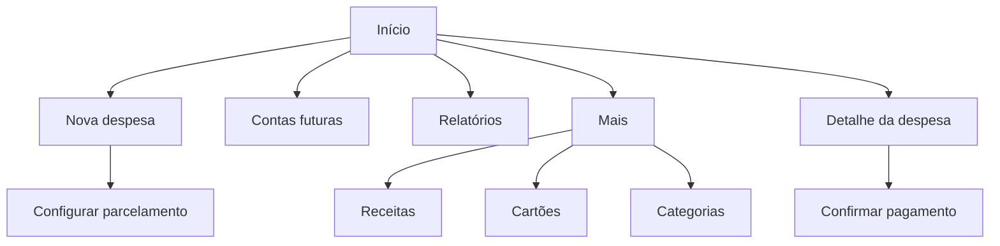

# Minhas Finanças — Wireframes da V1

## Visão geral

O arquivo [wireframes-v1.svg](wireframes-v1.svg) apresenta os wireframes de baixa fidelidade das oito telas centrais:

1. Início;
2. Nova despesa;
3. Compra parcelada;
4. Contas futuras;
5. Relatórios;
6. Mais;
7. Receitas;
8. Confirmação de pagamento.

## Navegação principal

## Decisões representadas

- A ação principal da tela Início abre diretamente **Nova despesa**.
- Receitas ficam no caminho **Mais > Receitas**.
- O mês pode ser alterado nas telas Início e Relatórios.
- Contas recorrentes sem valor confirmado aparecem em **Contas futuras**.
- A compra parcelada apresenta o total apenas como informação.
- O pagamento de uma despesa exige confirmação.
- A navegação inferior contém Início, Futuras, Relatórios e Mais.

## Limites destes wireframes

Os desenhos validam hierarquia, conteúdo e caminhos de navegação. Cores finais, tipografia, ícones, espaçamentos exatos, acessibilidade visual e componentes Material serão definidos na etapa de design visual.
